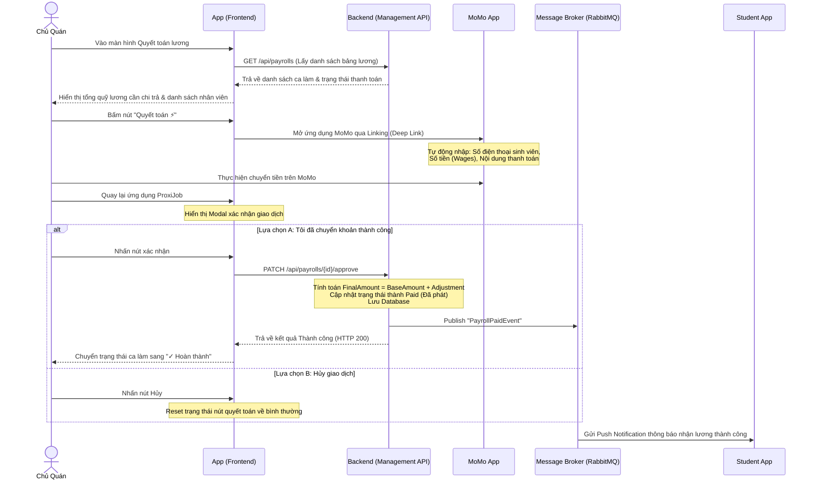

# Quy Trình Quyết Toán Tự Động (Automatic Payroll Settlement Flow)

Tài liệu này mô tả chi tiết luồng hoạt động của tính năng **Quyết toán lương tự động** dành cho **Chủ cửa hàng (Employer/Business)** trên nền tảng ProxiJob, bao gồm cả thiết kế ở Frontend (Mobile App) và Backend (Services).

---

## 1. Sơ Đồ Luồng Hoạt Động (Flow Sequence)

---

## 2. Thiết Kế & Xử Lý Ở Frontend (Mobile App - React Native)

Giao diện quyết toán lương nằm tại màn hình [PayrollSettlementScreen.js](file:///d:/ProxiJob/src/ProxiJob_Mobile/src/screens/employer/PayrollSettlementScreen.js).

### A. Tải Dữ Liệu Lương & Chấm Công
* Khi chủ cửa hàng truy cập màn hình, App sử dụng React Query để tải dữ liệu song song:
  * API Hook `usePayrollsQuery` (gọi endpoint `GET /api/payrolls`) để lấy danh sách bảng lương.
  * API Hook `useAttendanceLogsQuery` (gọi endpoint `GET /api/timekeeping`) để lấy danh sách nhật ký chấm công.
* Lọc danh sách các ca làm đã hoàn thành (`status === 'completed'`) nhưng chưa được quyết toán để hiển thị trên giao diện.

### B. Hiển Thị Tổng Quỹ Lương & Danh Sách
* **Bento Card Summary**: Hiển thị tổng số tiền cần thanh toán cho toàn bộ ca làm đang chờ duyệt của tất cả nhân viên.
* **Danh sách ca trực**: Mỗi ca làm việc hiển thị dưới dạng một thẻ Bento chi tiết bao gồm:
  * Ảnh đại diện và tên nhân viên (sinh viên).
  * Tiêu đề công việc và chi nhánh cửa hàng.
  * Chi tiết ngày làm, giờ làm thực tế, và mức lương/giờ.
  * **Trạng thái xác thực**: Hiển thị nhãn `✓ Xác thực GPS` để chứng minh ca trực chấm công hợp lệ bằng định vị GPS/QR Code.
  * **Thành tiền**: Tự động tính toán bằng: `Số giờ làm thực tế * Mức lương giờ`.

### C. Tích Hợp Ví Điện Tử MoMo (App-to-App Deep Linking)
* Khi chủ cửa hàng nhấn nút **"Quyết toán ⚡"**:
  1. **Kích hoạt Đường dẫn Liên kết Nhận tiền (Universal Link)**: Bỏ qua hoàn toàn cơ chế MoMo Sandbox giả lập (vốn yêu cầu tài khoản test). Hệ thống sử dụng trực tiếp đường dẫn chuyển tiền thật cá nhân của MoMo:
     * Định dạng URL: `https://nhantien.momo.vn/{sdt}/{so_tien}`.
     * Khi nhấn nút, app gọi `Linking.openURL(momoUrl)` để kích hoạt ứng dụng MoMo trên điện thoại chủ quán. MoMo sẽ tự động điền sẵn (pre-fill) thông tin người nhận (SĐT của sinh viên) và số tiền lương thực tế của ca làm. Chủ quán chỉ cần quét vân tay hoặc nhập mã PIN là tiền thật được chuyển trực tiếp vào ví MoMo của sinh viên.
     * **Mã QR động trong Modal**: Đồng thời, bên trong Hộp thoại xác nhận (Overlay Modal) trên ProxiJob sẽ hiển thị một mã QR thanh toán MoMo tương ứng để hỗ trợ chủ quán quét mã trực tiếp nếu việc tự động mở app gặp sự cố hoặc muốn chuyển khoản bằng thiết bị khác. Giao dịch này là giao dịch thật 100%.
  2. **Trạng thái chuyển đổi (Switching State)**:
     * Nút "Quyết toán ⚡" hiển thị vòng xoay loading (`ActivityIndicator`) và hiển thị dòng mô tả: *"Đang mở ứng dụng MoMo để thanh toán..."*.
  3. **Hộp thoại xác nhận (Overlay Modal)**:
     * Một Modal đè (Overlay Modal) hiển thị trên màn hình ProxiJob để chờ chủ quán thao tác từ ví MoMo quay lại:
       * **Lựa chọn A ("Tôi đã chuyển khoản thành công")**: Gọi API Mutation `useApprovePayrollMutation` gửi request `PATCH /api/payrolls/{id}/approve` để lưu trạng thái `Paid` vĩnh viễn ở PostgreSQL và đẩy sự kiện qua RabbitMQ thông báo cho sinh viên.
       * **Lựa chọn B ("Hủy giao dịch")**: Reset trạng thái của ca trực và ẩn modal để chủ quán có thể thực hiện lại.
  4. **Nút bấm trực quan (Visual Indicator)**:
     * Nút quyết toán được thiết kế thêm logo MoMo nhỏ màu hồng thương hiệu bên trái để tăng tính trải nghiệm ví điện tử. Giao diện tối giản, tối ưu cho Light Mode của ProxiJob.

---

## 3. Thiết Kế & Xử Lý Ở Backend (ASP.NET Core API - Management Service)

Backend chịu trách nhiệm tính toán số liệu và kiểm soát nghiệp vụ tại [PayrollsController.cs](file:///d:/ProxiJob/src/Management/ProxiJob.Management.API/Controllers/PayrollsController.cs).

### A. Tác Vụ Tính Toán Lương Tự Động (Calculate Payroll)
* **Kích hoạt**: Chạy định kỳ thông qua Hangfire Job hoặc gọi thủ công qua endpoint `POST /api/payrolls/calculate` gửi kèm [CalculatePayrollCommand](file:///d:/ProxiJob/src/Management/ProxiJob.Management.Application/Features/Payrolls/Commands/CalculatePayrollCommand.cs).
* **Quy trình xử lý**:
  1. Lấy thông tin nhân viên (Employee) và kiểm tra quyền truy cập của chủ quán (BusinessId).
  2. Truy vấn danh sách chấm công (`Timekeepings`) hợp lệ có Check-out (`CheckOutTime.HasValue`) và có trạng thái là `OnTime` hoặc `Late` trong khoảng thời gian được cấu hình (`FromDate` đến `ToDate`).
  3. Tính toán **`BaseAmount` (Mức lương cơ bản)**:
     * *Nhân viên ngoài (External / Thời vụ)*: Cộng dồn mức lương cố định của ca trực `JobShiftSalary`.
     * *Nhân viên nội bộ theo giờ (Internal - Hourly)*: `Tổng giờ làm thực tế * Mức lương giờ (HourlyRate)`.
     * *Nhân viên nội bộ theo tháng (Internal - Monthly)*: Lấy mức lương cứng theo tháng.
  4. Tạo bản ghi `Payroll` mới trong cơ sở dữ liệu với trạng thái là `Pending` (Chờ duyệt).

### B. Duyệt Chi Trả Lương (Approve & Pay Payroll)
* **Kích hoạt**: Nhận yêu cầu từ Client gửi đến endpoint `PATCH /api/payrolls/{id}/approve` kèm theo [ApprovePayrollCommand](file:///d:/ProxiJob/src/Management/ProxiJob.Management.Application/Features/Payrolls/Commands/ApprovePayrollCommand.cs).
* **Quy trình xử lý**:
  1. Truy vấn bản ghi `Payroll` tương ứng theo `PayrollId` và xác thực quyền sở hữu của `BusinessId`.
  2. Kiểm tra trạng thái hiện tại (nếu bảng lương đã thanh toán `Paid` thì chặn lại không cho xử lý tiếp).
  3. **Điều chỉnh lương (nếu có)**: Áp dụng khoản điều chỉnh thưởng/phạt từ chủ cửa hàng:
     $$\text{FinalAmount} = \text{BaseAmount} + \text{Adjustment}$$
  4. Chuyển đổi trạng thái bảng lương thành `PayrollStatus.Paid` và lưu ngày thanh toán `PayDate` là ngày hiện tại.
  5. Lưu các thay đổi vào cơ sở dữ liệu (`_context.SaveChangesAsync`).
  6. **Đồng bộ sự kiện bất đối xứng (Event-Driven)**:
     * Sử dụng MassTransit để publish sự kiện `PayrollPaidEvent` lên RabbitMQ Message Broker.
     * **Notification Service** ở Backend sẽ lắng nghe sự kiện này và gửi tin nhắn thông báo đẩy (Push Notification) đến thiết bị di động của Sinh viên để báo nhận lương thành công.
