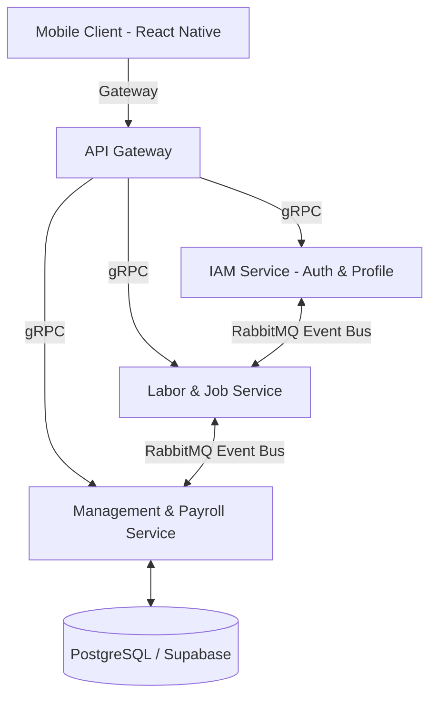

# Báo cáo Tóm tắt Dự án - ProxiJob (Project Executive Summary)

Tài liệu bàn giao cho Hội đồng Giám khảo môn học **EXE201 - Đại học FPT**. Trình bày dưới góc nhìn của **Tech Startup Founder & Product Director**, cung cấp cái nhìn toàn diện từ định vị tầm nhìn kinh doanh (Business Vision) đến giải pháp thực thi công nghệ (Technical Execution) của dự án **ProxiJob**.

---

## I. Tổng quan Dự án & Sứ mệnh (Project Identity & Mission)

* **Tên Dự án**: **ProxiJob** - Nền tảng kết nối công việc bán thời gian tức thời dựa trên vị trí siêu cục bộ dành cho sinh viên Gen-Z (*The Ultimate Hyper-Local Part-Time Job Matching Platform for Gen-Z Students*).
* **Mô hình**: Nền tảng kết nối hai chiều (Dual-sided Platform) giữa:
  - **Sinh viên Đại học (Gen-Z)** có nhu cầu tìm kiếm công việc bán thời gian ngắn hạn, ca lẻ tiện lợi xung quanh vị trí học tập/sinh hoạt.
  - **Chủ cửa hàng (F&B / Bán lẻ / Dịch vụ)** có nhu cầu tối ưu hóa và lắp đầy các ca làm việc trống bằng nhân sự tức thời một cách linh hoạt.
* **Chỉ số Cam kết Vận hành & Kỹ thuật (The SLA Metrics)**:
  - ⚡ **1.2 giây**: Tốc độ xử lý đồng bộ và ghép ca trực giữa chủ cửa hàng và ứng viên.
  - 📍 **100 mét**: Bán kính định vị vùng an toàn (Geofencing) giới hạn quét tìm việc và điểm danh tại chỗ.
  - 💵 **98%**: Tỷ lệ chi trả lương tức thì qua ví điện tử liên kết ngay sau khi hoàn thành Check-out ca trực.

---

## II. Bài toán Thị trường & Giải pháp Sản phẩm (Pain Point & Solution)

### 1. Nỗi đau thị trường (The Pain Point)
- **Đối với Sinh viên**: Các nền tảng tuyển dụng truyền thống quá chậm, không hiển thị khoảng cách di chuyển thực tế (vấn đề cốt lõi của sinh viên chưa có phương tiện cá nhân) và thường giam lương từ 2 đến 4 tuần, gây khó khăn cho việc trang trải chi phí sinh hoạt hàng ngày.
- **Đối với Chủ cửa hàng**: Nhu cầu nhân sự biến động liên tục theo giờ cao điểm nhưng việc tuyển dụng lại tốn nhiều thời gian. Sự thiếu hụt nhân sự đột xuất ảnh hưởng trực tiếp đến doanh thu và trải nghiệm khách hàng.

### 2. Giải pháp đột phá từ ProxiJob (The Solution)
ProxiJob ứng dụng công nghệ **định vị GPS thời gian thực và Geofencing** để ghép cặp sinh viên với các ca làm việc trống gần nhất (trong bán kính <100m). Chủ cửa hàng dễ dàng quản lý đồng thời hai nhóm nhân sự trên một Dashboard hợp nhất:
- **Nhân viên nội bộ (Internal Staff)**: Nhân sự cố định của quán (ví dụ: Barista, Thu ngân, Bảo vệ).
- **Nhân viên vãng lai (On-Demand Workers)**: Nhân sự ca lẻ trực tức thời (ví dụ: Phục vụ chạy bàn, Nhân viên kho, Shipper giao hàng).

---

## III. Kiến trúc Kỹ thuật Hệ thống (High-Level System Architecture)

Hệ thống được thiết kế theo tiêu chuẩn sản phẩm lớn (Enterprise-grade) nhằm đảm bảo khả năng mở rộng, độ bảo mật và tính toàn vẹn dữ liệu.

* **Phong cách kiến trúc**: Microservices được phát triển trên nền tảng **C# và .NET 8**, tuân thủ nghiêm ngặt mô hình **Clean Architecture**, nguyên lý thiết kế **SOLID** và mô hình **CQRS** (phân tách lệnh đọc/ghi dữ liệu).
* **Kết nối liên dịch vụ (Inter-service Communication)**:
  - Sử dụng **gRPC** để giao tiếp đồng bộ hiệu năng cao và độ trễ cực thấp giữa các microservices nội bộ.
  - Tích hợp **RabbitMQ** làm Event Bus xử lý các sự kiện bất đồng bộ giữa các dịch vụ (ví dụ: tự động xếp lịch trực ở Management Service khi Job Service phê duyệt ứng viên).
* **Triển khai & Vận hành (DevOps)**: Toàn bộ hệ thống được container hóa bằng **Docker** và thiết lập quy trình tích hợp liên tục tự động (CI/CD) thông qua pipeline **Jenkins**.
* **Đảm bảo tính bảo mật và toàn vẹn dữ liệu**:
  - Cơ chế phân quyền dựa trên quyền hạn chi tiết (Privilege-based Access Control), trong đó `'READ_ONLY'` được cấu hình như một đặc quyền tường minh thay vì chỉ sử dụng code Role cứng nhắc thông thường.
  - Sử dụng các lớp Validation trung gian kiểm tra Số Căn cước công dân (CCCD) chặt chẽ tại tầng Repository để ngăn ngừa triệt để các lỗi ngoại lệ (Exceptions) dữ liệu trùng lặp trong hệ thống database.

---

## IV. Tiến độ Phiên bản MVP Sẵn sàng Khảo sát (Current MVP Progress)

Hệ thống hiện tại đã sẵn sàng để hội đồng khảo sát và chạy thử nghiệm phiên bản ứng dụng di động thực tế (với ngôn ngữ thiết kế Light Mode kết hợp hiệu ứng kính mờ Glassmorphism cao cấp):

1. **Bảng điều khiển chủ cửa hàng (Enterprise Dashboard)**:
   - Tài khoản doanh nghiệp mẫu hoạt động ở gói **Enterprise** dưới tên chủ quán đại diện `'DN Test ProxiJob'`.
   - Nút Avatar góc phải hỗ trợ mở Menu Dropdown nổi (Floating Menu) cho phép chuyển hướng xem các gói dịch vụ nâng cấp, xem chi tiết hồ sơ cửa hàng, liên kết nút Đóng và Đăng xuất an toàn.
2. **Quản lý tuyển dụng thông minh**:
   - Hiển thị danh sách thẻ tin tuyển dụng thực tế cùng thông tin ca trực rõ ràng, mức lương thỏa thuận theo giờ (ví dụ: 35.000 đ/h) cùng nhãn ứng viên tự động đồng bộ.
   - Hỗ trợ thao tác thêm mới tin đăng qua form wizard, cho phép chỉnh sửa trực tiếp thông tin và thực hiện xóa tin đăng real-time ngay trên giao diện danh sách quản lý.
3. **Giám sát vị trí thực tế & Radar GPS Live**:
   - Bản đồ định vị GPS (Leaflet API) theo dõi hoạt động điểm danh nhân sự thời gian thực.
   - Hiển thị danh sách nhân viên nội bộ và vãng lai với phím tắt hỗ trợ liên lạc trực tiếp (giao diện gọi điện và chat room mô phỏng quy trình).
