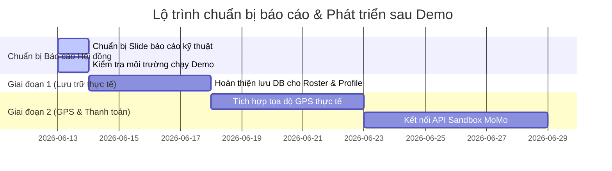

# Báo cáo Tiến độ & Tích hợp Kỹ thuật API - ProxiJob (Dự án EXE201)

Báo cáo này trình bày chi tiết về trạng thái tích hợp của các API trong hệ thống microservices ProxiJob theo mô hình Clean Architecture sử dụng .NET, gRPC và RabbitMQ, phân chia rõ ràng giữa các phần đã triển khai thực tế (Real), phần giả lập phục vụ demo (Mock) và các API hiện có ở Backend nhưng chưa tích hợp lên App di động.

## Tổng quan Kiến trúc Hệ thống
Hệ thống vận hành theo mô hình microservices phi tập trung, kết nối qua API Gateway bao gồm:
- **Clean Architecture** (.NET 8 Core API) cho các dịch vụ nghiệp vụ.
- **gRPC** kết nối đồng bộ hiệu năng cao giữa các dịch vụ nội bộ (Identity <-> Job <-> Management).
- **RabbitMQ** đóng vai trò Event Bus cho các tác vụ bất đồng bộ (ví dụ: đồng bộ trạng thái ca làm, ghi log).
- **Supabase / PostgreSQL** dùng làm cơ sở dữ liệu lưu trữ chính.

---

## 1. Dịch vụ Quản lý Định danh & Quyền hạn (IAM Service / Identity API)

| Endpoint API | Chức năng nghiệp vụ | Tech Stack | Trạng thái trên App | Chi tiết kỹ thuật & Xác thực Database |
| :--- | :--- | :--- | :--- | :--- |
| `POST /api/auth/register` | Đăng ký tài khoản mới | REST | **100% Implemented** | Ghi nhận dữ liệu tài khoản và mã hóa mật khẩu trong cơ sở dữ liệu Identity DB. |
| `POST /api/auth/login` | Đăng nhập hệ thống | REST | **100% Implemented** | Xác thực thông tin, trả về mã JWT Token chứa Claims người dùng và phân quyền. |
| `POST /api/auth/refresh` | Làm mới JWT token | REST | **100% Implemented** | Cơ chế tự động gọi ngầm để gia hạn phiên làm việc của người dùng khi token hết hạn. |
| `GET /api/auth/profile` | Lấy thông tin tài khoản | REST | **100% Implemented** | Lấy dữ liệu cơ bản của người dùng đang đăng nhập để hiển thị nhanh trên header. |
| `GET /api/student/profile` | Xem hồ sơ cá nhân sinh viên | REST / gRPC | **100% Implemented** | Lấy dữ liệu hồ sơ thực tế bao gồm Trường, Ngành học, Kỹ năng và E-portfolio từ PostgreSQL. |
| `PUT /api/student/profile` | Cập nhật hồ sơ sinh viên | REST | **100% Implemented** | Lưu trữ ảnh đại diện qua Supabase Storage, lưu thông tin tọa độ GPS cơ sở và chi tiết lý lịch. |
| `GET /api/business/profile` | Lấy hồ sơ Doanh nghiệp | REST | **Mocked trên UI** | Hiện đang trả về dữ liệu mẫu của quán cà phê `'DN Test ProxiJob'` để đồng bộ giao diện. |
| `PUT /api/business/profile` | Cập nhật hồ sơ Doanh nghiệp | REST | **Mocked trên UI** | Nút Lưu thông tin mới chỉ thông báo thành công ở Client, chưa gửi payload về DB thực. |
| `GET /api/plans` | Xem danh sách các gói dịch vụ | REST | **100% Implemented** | Hiển thị các gói nâng cấp tài khoản doanh nghiệp (Enterprise, Premium, Standard). |
| `POST /api/payments/momo` | Khởi tạo giao dịch ví MoMo | REST / MoMo API | **Mocked trên UI** | Nút liên kết nâng cấp gói chỉ dừng lại ở giao diện Sandbox mô phỏng, chưa gọi link thanh toán thật. |

---

## 2. Dịch vụ Tin tuyển dụng & Ứng tuyển (Personnel & Job Matching Service / Job API)

| Endpoint API | Chức năng nghiệp vụ | Tech Stack | Trạng thái trên App | Chi tiết kỹ thuật & Xác thực Database |
| :--- | :--- | :--- | :--- | :--- |
| `POST /api/job-posts` | Tạo tin tuyển dụng mới | REST / RabbitMQ | **100% Implemented** | Ghi nhận tin tuyển dụng, tự động đẩy sự kiện qua event bus RabbitMQ để đồng bộ trạng thái ca trực. |
| `PUT /api/job-posts/{id}` | Chỉnh sửa tin tuyển dụng | REST | **100% Implemented** | Cho phép chỉnh sửa thông tin (tiêu đề, yêu cầu, lương, kỹ năng) cho các tin ở trạng thái Draft/Published. |
| `DELETE /api/job-posts/{id}` | Xóa tin tuyển dụng | REST | **100% Implemented** | Thực hiện soft-delete trên database và thu hồi các ca làm việc liên kết với tin đăng đó. |
| `GET /api/job-posts/business/{id}`| Lấy tin đăng theo doanh nghiệp | REST | **100% Implemented** | Hiển thị danh sách tin tuyển dụng trên màn hình quản lý của chủ quán. |
| `GET /api/job-posts/published` | Xem tin tuyển dụng đang hoạt động | REST | **100% Implemented** | Sinh viên tìm kiếm ca làm việc xung quanh mình thông qua bộ lọc và bán kính tìm kiếm. |
| `POST /api/shifts/{id}/apply` | Nộp đơn ứng tuyển ca làm | REST | **100% Implemented** | Ghi nhận hồ sơ ứng tuyển của sinh viên vào hàng đợi duyệt của ca làm việc cụ thể. |
| `GET /api/shifts/{id}/applications`| Lấy danh sách hồ sơ ứng tuyển | REST / gRPC | **100% Implemented** | Hiển thị thông tin lý lịch tự thuật và E-portfolio bảo chứng GPS của sinh viên cho chủ quán duyệt. |
| `PATCH /api/applications/{id}/approve`| Phê duyệt ứng viên nhận việc | REST / RabbitMQ | **100% Implemented** | Duyệt ứng viên, tự động tạo lịch trình trực cho nhân viên đó ở Management Service qua RabbitMQ. |
| `PATCH /api/applications/{id}/reject` | Từ chối đơn ứng tuyển | REST | **100% Implemented** | Chuyển đổi trạng thái đơn ứng tuyển sang Từ chối và gửi thông báo về thiết bị của sinh viên. |
| `DELETE /api/applications/{id}/withdraw`| Rút đơn ứng tuyển | REST | **Chưa tích hợp trên App**| API đã sẵn sàng ở Backend nhưng UI app di động chưa thiết kế nút hủy nộp đơn. |
| `PATCH /api/applications/{id}/cancel` | Hủy ca làm sau khi đã được duyệt | REST | **Chưa tích hợp trên App**| Tính năng hủy nhận việc/bỏ ca chưa được đưa lên UI (nhằm đảm bảo cam kết chất lượng ban đầu). |

---

## 3. Dịch vụ Chấm công & Quyết toán (Schedule & Payroll Service / Management API)

| Endpoint API | Chức năng nghiệp vụ | Tech Stack | Trạng thái trên App | Chi tiết kỹ thuật & Xác thực Database |
| :--- | :--- | :--- | :--- | :--- |
| `GET /api/employees` | Xem danh sách nhân viên | REST / gRPC | **100% Implemented** | Trả về danh sách nhân viên thực tế đang quản lý (Nguyễn Minh Hoàng, Trần Thị Mai, Nguyễn Duy Khôi...). |
| `POST /api/employees` | Thêm nhân viên nội bộ thủ công | REST | **Mocked trên UI** | Form nhập liệu hoạt động trên giao diện nhưng chưa gọi API để insert bản ghi nhân sự vào cơ sở dữ liệu. |
| `DELETE /api/employees/{id}` | Xóa nhân sự khỏi cửa hàng | REST | **100% Implemented** | Xóa nhân viên ra khỏi danh sách HRM và thu hồi các ca trực đã xếp lịch trong tương lai. |
| `PATCH /api/employees/{id}/terminate`| Đình chỉ / Cho thôi việc | REST | **100% Implemented** | Chuyển trạng thái nhân sự sang ngưng hoạt động trên database. |
| `GET /api/schedules` | Xem lịch làm việc tổng hợp | REST | **100% Implemented** | Tải thông tin lịch trình ca làm việc theo ngày/tuần để hiển thị dạng lịch biểu cho chủ quán. |
| `POST /api/employees/{id}/schedules`| Xếp lịch trực cho nhân sự | REST | **100% Implemented** | Tạo ca làm việc cụ thể và gán cho nhân viên nội bộ/vãng lai đã chọn trên bảng xếp lịch. |
| `DELETE /api/schedules/{id}` | Hủy ca làm trực tiếp trên lịch | REST | **100% Implemented** | Xóa bản ghi lịch làm việc cụ thể và thu hồi ca trực khỏi tài khoản của nhân viên đó. |
| `POST /api/timekeeping/check-in` | Điểm danh vào ca trực | REST | **Tích hợp một phần** | Tích hợp định vị GPS thực tế. Camera quét khuôn mặt và quét mã QR tại chỗ đang giả lập (Mock) trên UI di động. |
| `POST /api/timekeeping/check-out` | Điểm danh kết thúc ca làm | REST | **Tích hợp một phần** | Ghi nhận giờ công thực tế dựa trên định vị GPS. QR Code check-out đang giả lập (Mock) trên UI di động. |
| `GET /api/timekeeping` | Xem nhật ký chấm công trong ngày | REST | **100% Implemented** | Hiển thị danh sách nhân sự đang trực trên bản đồ định vị GPS Live và danh sách chấm công. |
| `N/A (Phím tắt Chat & Call)`| Liên lạc nhân sự từ HRM | N/A | **Mocked trên UI** | Nút gọi/nhắn tin trên giao diện hiển thị nhanh nhưng chưa xử lý máy chủ chat hay tổng đài gọi ở Backend. |
| `GET /api/payrolls` | Xem danh sách lương ca trực | REST | **100% Implemented** | Tổng hợp số giờ làm thực tế từ bảng chấm công để tính tiền lương cần phát cho nhân viên. |
| `PATCH /api/payrolls/{id}/approve` | Duyệt chi lương ca trực | REST | **Mocked trên UI** | Nút quyết toán hiển thị giao dịch liên kết MoMo Sandbox thành công nhưng chưa phát sinh lệnh chuyển tiền thật. |
| `GET /api/timekeeping/suspicious` | Danh sách ca chấm công nghi vấn | REST | **Chưa tích hợp trên App**| Đã có API lấy các ca trực vi phạm Geofence (>100m) ở backend nhưng chưa làm màn hình xem riêng trên App. |
| `PATCH /api/timekeeping/{id}/confirm`| Phê duyệt ca trực nghi vấn | REST | **Chưa tích hợp trên App**| Nút duyệt/bỏ qua vi phạm GPS của nhân viên chưa được thiết kế trên giao diện chủ quán. |
| `POST /api/payrolls/calculate` | Tự động tính toán quỹ lương | REST | **Chưa tích hợp trên App**| Tác vụ chạy tự động định kỳ ở phía backend (Hangfire), ứng dụng di động không gọi trực tiếp. |
| `PATCH /api/qr-code/radius` | Thiết lập bán kính điểm danh | REST | **Chưa tích hợp trên App**| Hiện tại bán kính Geofence an toàn đang mặc định cấu hình cứng là 100m ở phía Server. |

---

## Kế hoạch Hành động & Lộ trình Tiếp theo

### Các cột mốc quan trọng tiếp theo
1. **Lưu trữ dữ liệu HRM & Profile**: Kết nối API cho các tác vụ cập nhật Profile doanh nghiệp và lưu thông tin "Thêm nhân viên mới" vào PostgreSQL thực tế.
2. **Loại bỏ các API chưa dùng**: Ẩn hoặc loại bỏ các tính năng chưa dùng để làm gọn code, và tích hợp bổ sung màn hình kiểm soát ca trực nghi vấn (Suspicious Timekeepings) nếu hội đồng yêu cầu.
3. **Liên kết Cổng thanh toán**: Kết nối API hệ thống sang ví MoMo Sandbox để thực hiện quyết toán lương ca trực thông qua mã giao dịch thật và xử lý phản hồi webhook.
