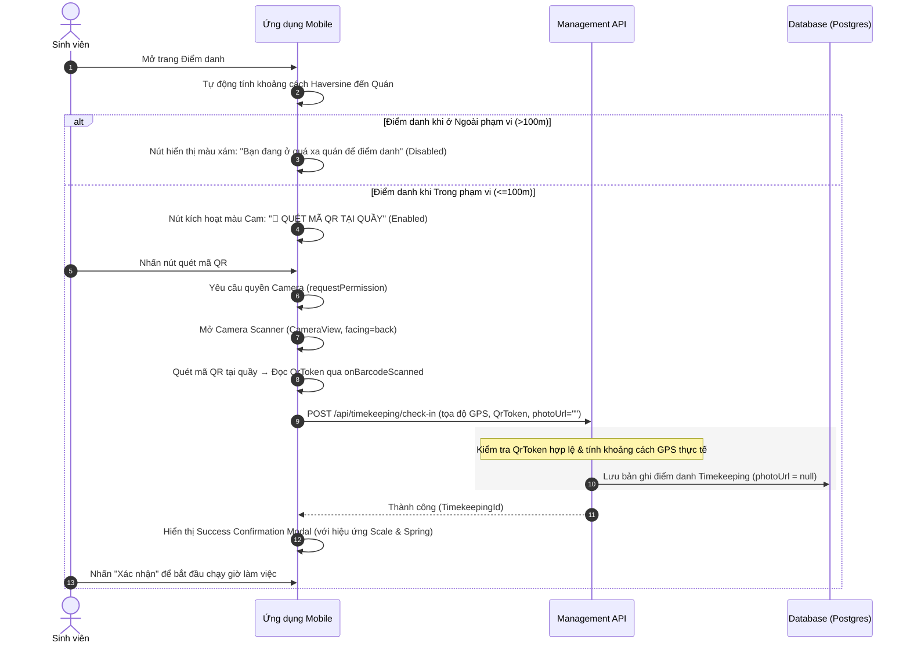
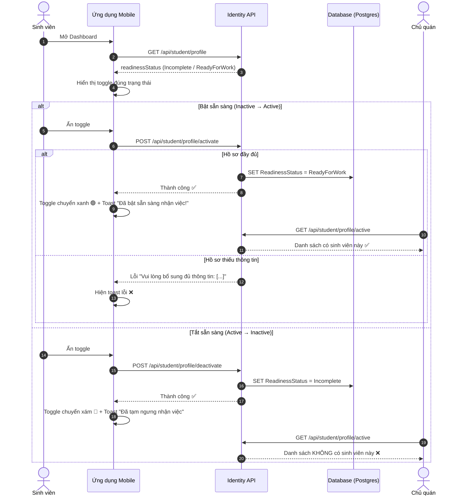

# Hướng Dẫn Kỹ Thuật: Xác Thực Hiện Diện & Quản Lý Trạng Thái Sinh Viên

Tài liệu này mô tả chi tiết cơ chế hoạt động và cách triển khai các tính năng xác thực hiện diện (GPS Geofencing + Quét mã QR), hiển thị mã QR động phía chủ quán, và nút chuyển đổi trạng thái sẵn sàng nhận việc (Active/Inactive) của sinh viên.

> [!NOTE]
> Hệ thống đã loại bỏ hoàn toàn bước nhận diện khuôn mặt và chụp ảnh Selfie bằng Camera trước để bảo vệ quyền riêng tư của người dùng, tối ưu hóa độ trễ kết nối mạng và đơn giản hóa trải nghiệm điểm danh.

---

## 🗺️ Yếu Tố 1: Cơ Chế Định Vị GPS & Địa Giới Di Động (Geofencing)

Hệ thống yêu cầu Sinh viên phải thực sự có mặt trong phạm vi hoạt động của cửa hàng (bán kính **100m**) để bắt đầu hoặc kết thúc ca làm.

### 📱 Phía Frontend (Mobile Client)
* **Tệp mã nguồn:** [StudentCheckIn.js](file:///d:/ProxiJob/src/ProxiJob_Mobile/src/screens/student/StudentCheckIn.js)
* **Xử lý nền tự động:**
  * Bản đồ Leaflet hiển thị vị trí thực tế của cửa hàng (`shopLat`, `shopLng`) và vị trí hiện tại của sinh viên (`studentLat`, `studentLng`) cùng vòng tròn bán kính an toàn 100m.
  * Khoảng cách Haversine được tính toán tự động trong background liên tục để xác định xem sinh viên đã ở trong vùng an toàn chưa.
* **Trạng thái nút hành động:**
  * **Ngoài bán kính (>100m):** Nút hành động chính sẽ bị vô hiệu hóa (`disabled`) và hiển thị văn bản cảnh báo màu xám: `"Bạn đang ở quá xa quán để điểm danh"`.
  * **Trong bán kính (<=100m):** Mở khóa ngay lập tức nút hành động chính, chuyển sang màu Cam thương hiệu của Sinh viên (`#FF6B00`) và hiển thị văn bản: `"📸 QUÉT MÃ QR TẠI QUẦY"`.

---

## 📸 Yếu Tố 2: Quét Mã QR Xác Thực Tại Quầy (Counter QR Scan)

Khi đã vượt qua lớp bảo mật GPS, yếu tố thứ 2 yêu cầu sinh viên phải quét đúng mã QR vật lý đặt tại quầy của cửa hàng để chứng minh sự hiện diện thực tế.

### 📱 Phía Frontend (Mobile Client)
* **Tệp mã nguồn:** [StudentCheckIn.js](file:///d:/ProxiJob/src/ProxiJob_Mobile/src/screens/student/StudentCheckIn.js)
* **Thư viện sử dụng:** `expo-camera` — sử dụng `CameraView` và `useCameraPermissions` để quét mã QR bằng camera vật lý của điện thoại.
* **Luồng quét mã QR:**
  1. Khi sinh viên bấm nút `"📸 QUÉT MÃ QR TẠI QUẦY"`, ứng dụng yêu cầu quyền truy cập Camera (`requestPermission()`).
  2. Nếu được cấp quyền, hiển thị màn hình Camera Scanner toàn màn hình với `CameraView` (camera sau `facing="back"`).
  3. `CameraView` được cấu hình `barcodeScannerSettings` để nhận diện mã QR (`type: "qr"`).
  4. Khi camera quét thành công mã QR → callback `onBarcodeScanned` trả về `qrToken` từ mã.
  5. Ứng dụng tự động đóng camera và gửi payload điểm danh (GPS + QR token) lên server.
* **Giao diện Camera Scanner:**
  * Overlay bán trong suốt tối giản, khung ngắm mục tiêu (viewfinder) bốn góc cam sắc nét.
  * Thanh laser quét màu cam chuyển động lên/xuống liên tục bằng `Animated` API.
  * Nút `"❌ Huỷ"` ở góc trên để đóng camera quay lại màn hình check-in.
* **Thông báo xác nhận thành công (Success Confirmation Modal):**
  * Ngay khi API phản hồi thành công, một thẻ xác nhận (`Check-in Thành công 🎉` hoặc `Check-out Thành công 🎉`) xuất hiện ở trung tâm màn hình sử dụng hiệu ứng chuyển động mượt mà (scale từ `0.8` lên `1.0` kết hợp spring và fade-in).
  * Thẻ hiển thị các thông tin chi tiết: Tên cửa hàng, tên ca làm, thời gian điểm danh thực tế (giờ:phút) và trạng thái đi làm (`Đúng giờ`, `Vào muộn` hoặc `Hoàn thành`).

### ⚙️ Phía Backend (Management API)
* **Tệp mã nguồn:** 
  * [CheckInCommand.cs](file:///d:/ProxiJob/src/Management/ProxiJob.Management.Application/Features/Timekeepings/Commands/CheckInCommand.cs)
  * [CheckOutCommand.cs](file:///d:/ProxiJob/src/Management/ProxiJob.Management.Application/Features/Timekeepings/Commands/CheckOutCommand.cs)
* **Xác thực QR phía máy chủ:**
  * Hệ thống truy vấn bảng `BusinessQrCodes` để kiểm tra tính hợp lệ và thời hạn hoạt động của `QrToken` nhận được từ client.
  * Tọa độ GPS gửi lên được tính toán lại so với tọa độ đăng ký của mã QR để gán nhãn trạng thái điểm danh (`OnTime`, `Late` hoặc `Suspicious`).
  * Tham số ảnh chụp khuôn mặt (`CheckInPhoto` / `CheckOutPhoto`) được truyền giá trị `null` hoặc chuỗi rỗng do tính năng chụp selfie đã được loại bỏ.

---

## 🖥️ Hiển Thị Mã QR Động Phía Chủ Quán (Employer QR Code)

Chủ quán có thể xem mã QR thực tế của cửa hàng mình ngay trên ứng dụng, mã QR này được tạo động dựa trên `QrToken` lưu trong database và có thể in ra đặt tại quầy.

### 📱 Phía Frontend (Mobile Client)
* **Tệp mã nguồn:** [EmployerMonitor.js](file:///d:/ProxiJob/src/ProxiJob_Mobile/src/screens/employer/EmployerMonitor.js)
* **Cách hoạt động:**
  * Khi chủ quán mở tab "Mã QR" trên màn hình Quản lý, ứng dụng gọi API `GET /api/qr-code` để lấy `QrToken` hiện tại.
  * Mã QR được render bằng hình ảnh từ API công khai `https://api.qrserver.com/v1/create-qr-code/?size=200x200&data={QrToken}`, tạo ra mã QR thực tế có thể quét được.
  * Hiển thị thông tin bổ sung: Token hiện tại, bán kính GPS cho phép (50m / 100m / 200m), trạng thái hoạt động.
  * Chủ quán có thể **thay đổi bán kính GPS** cho phép bằng cách chọn nút 50m / 100m / 200m trên giao diện.

### ⚙️ Phía Backend (Management API)
* **Tệp mã nguồn:**
  * [QrCodesController.cs](file:///d:/ProxiJob/src/Management/ProxiJob.Management.API/Controllers/QrCodesController.cs)
  * [GetQrCodeByBusinessQuery.cs](file:///d:/ProxiJob/src/Management/ProxiJob.Management.Application/Features/QrCodes/Queries/GetQrCodeByBusinessQuery.cs)
* **Phân quyền truy cập:**
  * Endpoint `GET /api/qr-code` cho phép cả 3 role truy cập: `Business`, `Student`, `Employee` — để sinh viên cũng có thể fetch QR token khi cần.
  * Endpoint `POST /api/qr-code/generate` và `PATCH /api/qr-code/radius` chỉ cho phép role `Business`.
  * Phương thức `GetBusinessId()` hỗ trợ resolve `BusinessId` cho cả chủ quán (từ claim) và sinh viên/employee (từ bảng `Employees`).

---

## 🔄 Trạng Thái Sẵn Sàng Nhận Việc (Student Availability Toggle)

Tính năng cho phép sinh viên bật/tắt trạng thái sẵn sàng nhận việc. Khi **Active** (🟢), chủ quán có thể tìm thấy sinh viên trong danh sách ứng viên sẵn sàng. Khi **Inactive** (🔴), sinh viên sẽ ẩn khỏi danh sách.

### 📱 Phía Frontend (Mobile Client)
* **Tệp mã nguồn:** [StudentDashboard.js](file:///d:/ProxiJob/src/ProxiJob_Mobile/src/screens/student/StudentDashboard.js)
* **API Client:** [studentApi.js](file:///d:/ProxiJob/src/ProxiJob_Mobile/src/api/studentApi.js) — hàm `activateStudentProfileApi()` và `deactivateStudentProfileApi()`
* **Vị trí trên giao diện:** Nằm ngay trong header của Dashboard, bên dưới dòng chào "Chào bạn, [tên] 👋" và nút GPS.
* **Cách hoạt động:**
  * Khi mở Dashboard, ứng dụng gọi `GET /api/student/profile` để lấy `readinessStatus` hiện tại và hiển thị toggle đúng trạng thái.
  * Toggle có animation mượt mà (Animated spring) khi chuyển đổi trạng thái.
  * **🟢 Active → ấn → 🔴 Inactive:** Gọi `POST /api/student/profile/deactivate` → hiện toast "Đã tạm ngưng nhận việc 🔴".
  * **🔴 Inactive → ấn → 🟢 Active:** Gọi `POST /api/student/profile/activate` → backend kiểm tra hồ sơ đã đầy đủ chưa:
    * Nếu **đủ thông tin** → chuyển sang `ReadyForWork` → hiện toast "Đã bật sẵn sàng nhận việc! 🟢".
    * Nếu **thiếu thông tin** → trả lỗi `"Vui lòng bổ sung đủ thông tin: [danh sách]"` → hiện toast lỗi.
* **Thiết kế UI:**
  * Khi Active: Nền xanh nhạt (`#F0FDF4`), viền xanh (`#86EFAC`), chấm xanh 🟢, text "Đang sẵn sàng nhận việc".
  * Khi Inactive: Nền xám nhạt (`#F8FAFC`), viền xám (`#E2E8F0`), chấm xám 🔴, text "Chưa sẵn sàng nhận việc".

### ⚙️ Phía Backend (Identity API)
* **Tệp mã nguồn:**
  * [StudentProfileController.cs](file:///d:/ProxiJob/src/Identity/ProxiJob.Identity.API/Controllers/StudentProfileController.cs) — endpoint `POST /api/student/profile/activate` và `POST /api/student/profile/deactivate`
  * [CompleteStudentProfileCommandHandler.cs](file:///d:/ProxiJob/src/Identity/ProxiJob.Identity.Application/Features/Students/Commands/CompleteStudentProfile/CompleteStudentProfileCommandHandler.cs) — handler kích hoạt (có kiểm tra hồ sơ đầy đủ)
  * [DeactivateStudentProfileCommandHandler.cs](file:///d:/ProxiJob/src/Identity/ProxiJob.Identity.Application/Features/Students/Commands/DeactivateStudentProfile/DeactivateStudentProfileCommandHandler.cs) — handler tạm ngưng
* **Domain Constants:** [ProfileReadinessStatus.cs](file:///d:/ProxiJob/src/Identity/ProxiJob.Identity.Domain/Constants/ProfileReadinessStatus.cs) — 3 trạng thái: `Incomplete`, `ReadyForWork`, `ProfileComplete`
* **Endpoint cho chủ quán:** `GET /api/student/profile/active` — chỉ trả về sinh viên có `ReadinessStatus = "ReadyForWork"`, giúp chủ quán tìm ứng viên sẵn sàng.

---

## 🔄 Quy Trình Điểm Danh 2FA Mới (GPS + QR)

---

## 🔄 Quy Trình Chuyển Đổi Trạng Thái Sẵn Sàng

